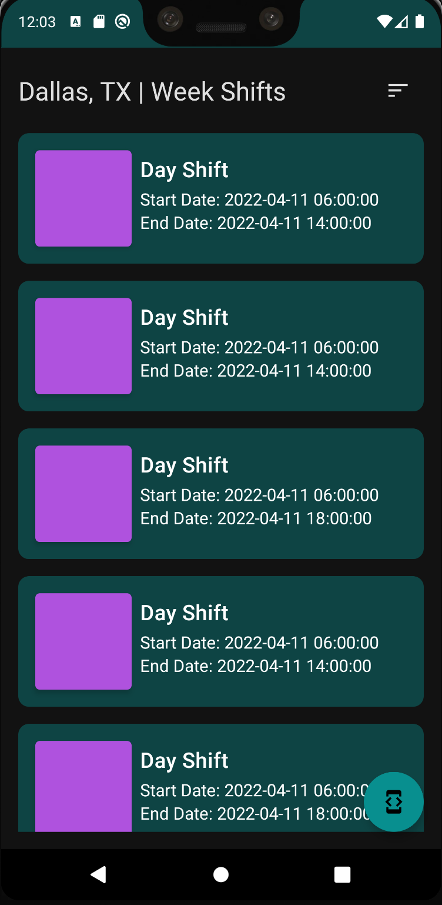
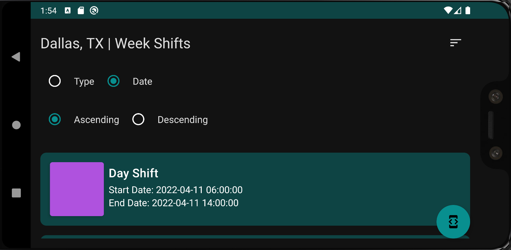
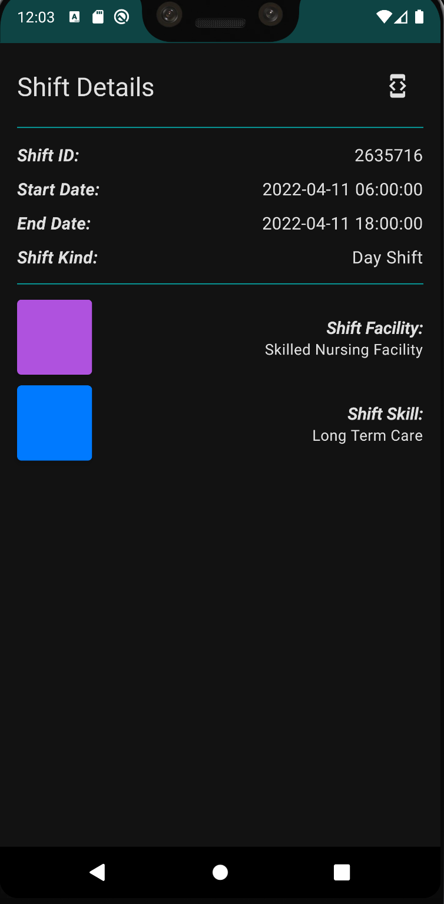
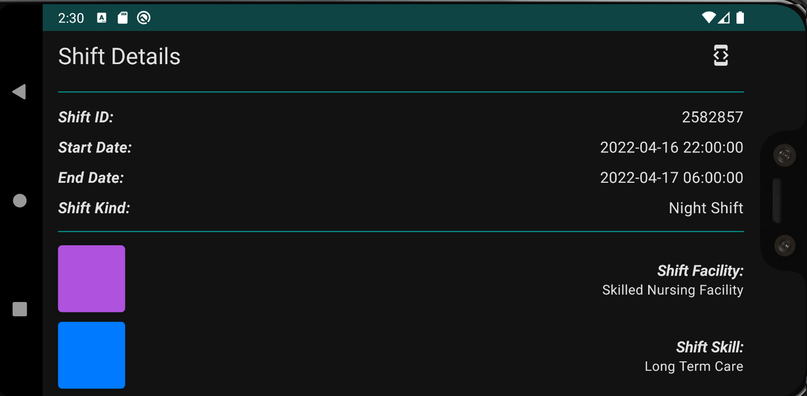

# Application made with Clean Architecture, MVVM pattern, Jetpack Compose consuming REST APIs

## Documentation and usage
Before you begin, please review the following prerequisites and documentation: https://bitbucket.org/shiftkeyllc/ios-coding-challenge/src/master/API-DOC.md

## App Instalation
To install the app download the shiftcomposeapp.apk file.

## Testing
In the class ShiftListViewModelTest you can find a unit tests using Google Truth, testing the initial states of the ViewModel and a function from the Util.kt class

```kotlin
    private lateinit var viewModel: ShiftListViewModel
    private var shiftFakeRepository: ShiftFakeRepository = ShiftFakeRepository()

    /** Setup the fake data */
    @Before
    fun setup() {
        viewModel = ShiftListViewModel(ShiftUseCase(GetShiftListCase(shiftFakeRepository)))
    }

    /** ShiftListViewModel init states test */
    @Test
    fun testShiftInitViewModelStates() {
        Assert.assertFalse(viewModel.state.value.isOrderSectionVisible)
        Assert.assertEquals(OrderType.Ascending, viewModel.state.value.shiftOrder.orderType)
    }

    /** Util simple test */
    @Test
    fun testColorUtil() {
        val result = getColor("#088F8F").toString().lowercase()
        val compare = Purple200.toString().lowercase()
        assertThat(result).contains(compare)
    }
```

## Functionality 
### Shift List Screen
In the first screen we have the list of shifts from the endpoint: https://staging-app.shiftkey.com/api/v2/available_shifts. 
- Each list item takes you to the shift detail screen for that specific shift.
- The icon at the top shows a sort panel to help find a specific shift.
- The floating button with the developer tools icon takes you to the developer LinkedIn profile.








### Shift List Screen
In the second screen shows detail information of a specifict shift.
- The icon at the top with the developer tools icon takes you to the developer LinkedIn profile.








## Dependencies
*  You can check the whole dependency stack and versions in Project build.gradle
```kotlin
    globaldependencies = [
            // Life cycle and architecture components dependencies
            lifecycleviewmodel    : "androidx.lifecycle:lifecycle-viewmodel-ktx:$lifecycleviewmodel_version",
            lifecycleruntime      : "androidx.lifecycle:lifecycle-runtime-ktx:$lifecycleruntime_version",
            splashscreen          : "androidx.core:core-splashscreen:$splashscreen_version",
            coroutines            : "org.jetbrains.kotlinx:kotlinx-coroutines-android:$coroutines_version",
            // Dependency injection
            hiltandroid           : "com.google.dagger:hilt-android:$hiltandroid_version",
            hiltandroidcompiler   : "com.google.dagger:hilt-android-compiler:$hiltandroidcompiler_version",
            hiltlifecycleviewmodel: "androidx.hilt:hilt-lifecycle-viewmodel:$hiltlifecycleviewmodel_version",
            hiltnavigationcompose : "androidx.hilt:hilt-navigation-compose:$hiltnavigationcompose_version",
            // Kotlin Compose
            composeui             : "androidx.compose.ui:ui:$compose_version",
            composematerial       : "androidx.compose.material:material:$compose_version",
            uitoolingpreview      : "androidx.compose.ui:ui-tooling-preview:$compose_version",
            activitycompose       : "androidx.activity:activity-compose:$activitycompose_version",
            viewmodelcompose      : "androidx.lifecycle:lifecycle-viewmodel-compose:$viewmodelcompose_version",
            navigationcompose     : "androidx.navigation:navigation-compose:$navigationcompose_version",
            iconsextended         : "androidx.compose.material:material-icons-extended:$compose_version",
            // API connection dependencies
            retrofit              : "com.squareup.retrofit2:retrofit:$retrofit_version",
            convertergson         : "com.squareup.retrofit2:converter-gson:$convertergson_version",
            // Testing dependencies
            junit                 : "junit:junit:$junit_version",
            truth                 : "com.google.truth:truth:$truth_version",
    ]
```

## Legal
The use of the API and any related documentation is governed by the owner and must be used in accordance with the Terms and Conditions policies, which may be found at: 

- https://bitbucket.org/shiftkeyllc/ios-coding-challenge/src/master/API-DOC.md

The application code usage rights belong to David Antonio Moreno.
